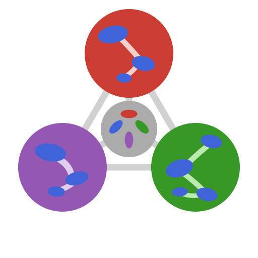

<div align="center">
  

  # MicroPoroChemoMechanics

  _Julia ecosystem for the coupled chemo-mechanics of porous reactive media_

  _Computational chemistry · Mean-field homogenization · Adaptive cubature · Structured tensors · Reactive transport · Poromechanics_
</div>

---

**MicroPoroChemoMechanics** is a family of Julia packages for the
multiscale modelling of porous reactive materials — from molecular-level
thermodynamic equilibrium to macroscopic poromechanical response.
Every package is `ForwardDiff`-compatible, dimensionally aware via
`DynamicQuantities` where relevant, and designed to compose cleanly
with the [SciML](https://sciml.ai/) ecosystem (`Optimization`,
`OrdinaryDiffEq`, `NonlinearSolve`, `Integrals`, …).

The stack is released through the dedicated
[**MPCM-Registry**](https://codeberg.org/MicroPoroChemoMechanics/MPCM-Registry).
Downstream users add the registry once before installing any package:

```julia
pkg> registry add https://codeberg.org/MicroPoroChemoMechanics/MPCM-Registry
```

---

## Packages

### [ChemistryLab.jl](https://codeberg.org/MicroPoroChemoMechanics/ChemistryLab.jl) — Computational chemistry toolkit

[](https://MicroPoroChemoMechanics.codeberg.page/ChemistryLab.jl/stable/)
[](https://MicroPoroChemoMechanics.codeberg.page/ChemistryLab.jl/dev/)
[](https://doi.org/10.5281/zenodo.17756074)

Formula parsing, species and reaction handling, stoichiometric matrix
construction, thermodynamic equilibrium via Gibbs free energy
minimisation, dilute-solution / Debye-Hückel / Davies activity models,
ideal and Redlich-Kister solid solutions, kinetics (Parrot–Killoh and
transition-state theory), and interoperability with **ThermoFun JSON**
and **PHREEQC** databases. Initially focused on cement chemistry but
applicable more broadly.

| Feature | Details |
|---|---|
| **Equilibrium** | Gibbs minimisation under mass-balance constraints |
| **Activity models** | Dilute solution; HKF aqueous solutes |
| **Solid solutions** | Ideal mix, Redlich-Kister (cement-data-18 calibrated) |
| **Kinetics** | TST, Parrot–Killoh for cement clinkers; coupled to OrdinaryDiffEq |
| **Calorimetry** | Isothermal and semi-adiabatic models with variable Cp |
| **AD** | ForwardDiff-compatible across the full pipeline |

---

### [TensND.jl](https://codeberg.org/MicroPoroChemoMechanics/TensND.jl) — Structured tensor types

[](https://MicroPoroChemoMechanics.codeberg.page/TensND.jl/stable/)
[](https://MicroPoroChemoMechanics.codeberg.page/TensND.jl/dev/)
[](https://doi.org/10.5281/zenodo.17985769)

Structured tensor types (`TensISO`, `TensWalpole`, `TensOrtho`, `TensTI`,
…) with base-1 indexing and symmetry-aware storage. Tensor calculations
of any order and dimension in arbitrary coordinate systems, symbolic
(`SymPy`, `Symbolics`) and numerical. Shared tensor-algebra backbone
across the MicroPoroChemoMechanics stack.

| Feature | Details |
|---|---|
| **Tensors** | `TensISO`, `TensWalpole`, `TensTI`, `TensOrtho`, generic `Tens` |
| **Bases** | Canonical, rotated, orthogonal, general (non-orthogonal, symbolic) |
| **Coord. systems** | Cartesian, polar, cylindrical, spherical, spheroidal |
| **Differential ops** | `GRAD`, `DIV`, `LAPLACE`, `HESSIAN` via Christoffel symbols |
| **AD** | ForwardDiff-compatible end-to-end |

---

### [MeanFieldHom.jl](https://codeberg.org/MicroPoroChemoMechanics/MeanFieldHom.jl) — Mean-field homogenization

[](https://MicroPoroChemoMechanics.codeberg.page/MeanFieldHom.jl/stable/)
[](https://MicroPoroChemoMechanics.codeberg.page/MeanFieldHom.jl/dev/)

Hill polarisation tensors for ellipsoidal inclusions and infinite
cylinders, crack-opening-displacement tensors with stress and
displacement intensity factors for flat (elliptic and ribbon) cracks,
second-order Hill tensors for transport problems, and layered-sphere
composite models — under a common abstraction hierarchy and dispatch
mechanism. Also ships `MeanFieldHom.Elliptic`, an internal type-generic
submodule for Legendre and Carlson elliptic integrals.

| Feature | Details |
|---|---|
| **Elasticity** | Hill polarisation tensor (2D/3D, iso and aniso matrix) |
| **Cracks** | COD tensor, SIF / DIF for elliptic and ribbon cracks |
| **Conductivity** | 2nd-order Hill tensor for transport problems |
| **Elliptic integrals** | Type-generic `K, E, F, R_F, R_D` (`Float64`, `Dual`, `BigFloat`, `Sym`, `Num`) |
| **Algorithms** | Analytical, Masson-style residue, DECUHR adaptive cubature |
| **AD** | ForwardDiff-compatible across every analytical and DECUHR path |

---

### Coming soon — Reactive transport coupled to macroscopic poromechanics

A forthcoming package will integrate the chemistry stack
(`ChemistryLab.jl` + `OptimaSolver.jl`) with effective-property
predictions from mean-field homogenization
(`MeanFieldHom.jl` + `TensND.jl`) into a coupled reactive-transport /
poromechanics framework, suitable for durability and degradation
studies of cementitious and geological porous media. Repository to be
announced.

---

## Backend dependencies

Lower-level libraries used internally by the main packages above. They
are designed to be reusable in their own right and can be installed and
cited standalone from the MPCM-Registry.

### [OptimaSolver.jl](https://codeberg.org/MicroPoroChemoMechanics/OptimaSolver.jl) — Primal-dual interior-point solver

[](https://MicroPoroChemoMechanics.codeberg.page/OptimaSolver.jl/stable/)
[](https://MicroPoroChemoMechanics.codeberg.page/OptimaSolver.jl/dev/)

Julia-native primal-dual interior-point solver for Gibbs-energy
minimisation under linear equality and bound constraints. Used by
`ChemistryLab.jl` as the default equilibrium solver. Schur-complement
Newton steps exploit the diagonal Hessian structure; filter-based line
search (Wächter & Biegler 2006); implicit differentiation provides
post-solve sensitivities (`∂n*/∂b`, `∂n*/∂(μ⁰/RT)`); warm-start support.
Julia port of the Optima C++ library by Allan Leal (ETH Zürich).

| Feature | Details |
|---|---|
| **Method** | Primal-dual interior-point with filter line search |
| **Newton step** | Schur-complement reduction (`m×m` instead of `(ns+m)×(ns+m)`) |
| **Sensitivities** | Implicit differentiation, ForwardDiff-compatible |
| **Warm start** | Persistent cache between solves |
| **SciML** | `OptimaOptimizer <: AbstractOptimizer` |

---

### [DECUHR.jl](https://codeberg.org/MicroPoroChemoMechanics/DECUHR.jl) — Adaptive cubature for vertex singularities

[](https://MicroPoroChemoMechanics.codeberg.page/DECUHR.jl/stable/)
[](https://MicroPoroChemoMechanics.codeberg.page/DECUHR.jl/dev/)

Pure-Julia port of the DECUHR algorithm (Espelid & Genz, 1994) for
automatic adaptive integration of functions with **vertex
singularities** over hyper-rectangular regions. Used by
`MeanFieldHom.jl` as the adaptive-cubature backend for the anisotropic
Hill and crack kernels. Exposed as a pluggable algorithm for the SciML
[Integrals.jl](https://docs.sciml.ai/Integrals/stable/) solver stack.

| Feature | Details |
|---|---|
| **Dimensions** | 2-D and 3-D integration on hyper-rectangles |
| **Singularities** | Vertex singularities with user or auto-estimated `α`; logarithmic weights |
| **Integrands** | Vector-valued; retcode compatible with Integrals.jl |
| **Extrapolation** | Richardson extrapolation on sub-region averages |

---

## Dependency graph

```
ChemistryLab.jl
  └── OptimaSolver.jl       (weakdep — equilibrium solver backend)

MeanFieldHom.jl
  ├── DECUHR.jl             (adaptive cubature backend)
  └── TensND.jl             (structured tensors)

[future] Reactive transport package
  ├── ChemistryLab.jl       (equilibrium + kinetics)
  └── MeanFieldHom.jl       (effective transport properties)
```

`TensND.jl`, `DECUHR.jl` and `OptimaSolver.jl` are standalone and can be
used outside the MPCM context.

---

## Status

| Package           | Role     | Visibility | Registered (MPCM-Registry) | Documentation |
|-------------------|----------|------------|----------------------------|---------------|
| `ChemistryLab.jl` | main     | Public     | Yes                        | [docs](https://MicroPoroChemoMechanics.codeberg.page/ChemistryLab.jl) |
| `TensND.jl`       | main     | Public     | Yes                        | [docs](https://MicroPoroChemoMechanics.codeberg.page/TensND.jl) |
| `MeanFieldHom.jl` | main     | Public     | Yes                        | [docs](https://MicroPoroChemoMechanics.codeberg.page/MeanFieldHom.jl) |
| Reactive transport| main     | —          | Pending                    | —             |
| `OptimaSolver.jl` | backend  | Public     | Yes                        | [docs](https://MicroPoroChemoMechanics.codeberg.page/OptimaSolver.jl) |
| `DECUHR.jl`       | backend  | Public     | Yes                        | [docs](https://MicroPoroChemoMechanics.codeberg.page/DECUHR.jl) |

---

## Quick start

```julia
using Pkg
Pkg.Registry.add(RegistrySpec(url="https://codeberg.org/MicroPoroChemoMechanics/MPCM-Registry"))
Pkg.add(["ChemistryLab", "OptimaSolver", "MeanFieldHom", "DECUHR", "TensND"])

# Compute a thermodynamic equilibrium (Portlandite dissolution)
using ChemistryLab, OptimaSolver
# … see ChemistryLab.jl documentation for full examples

# Compute a Hill polarisation tensor for a sphere in an isotropic matrix
using MeanFieldHom, TensND
E, ν = 210e3, 0.3
λ = E * ν / ((1 + ν) * (1 - 2ν));  μ = E / (2 * (1 + ν))
C₀ = TensISO{3}(3 * (λ + 2μ / 3), 2μ)
P  = hill_tensor(Ellipsoid(1.0), C₀)
```

---

## Authors & Institution

Developed by [**Jean-François Barthélémy**](https://codeberg.org/jfbarthelemy)
and [**Anthony Soive**](https://codeberg.org/anthonysoive), both researchers at
[Cerema](https://www.cerema.fr/en) in the research unit
[UMR MCD](https://mcd.univ-gustave-eiffel.fr/). See each package's
`CITATION.cff` for per-package authorship and contributors.

## Credits and acknowledgements

Parts of this codebase were developed with the assistance of
Anthropic's *Claude Code*, under the authors' review and validation.

## License

See the `LICENSE` file of each repository.

**Main packages:**

- [ChemistryLab.jl](https://codeberg.org/MicroPoroChemoMechanics/ChemistryLab.jl/src/branch/main/LICENSE) — LGPL-2.1-or-later
- [TensND.jl](https://codeberg.org/MicroPoroChemoMechanics/TensND.jl/src/branch/main/LICENSE) — MIT
- [MeanFieldHom.jl](https://codeberg.org/MicroPoroChemoMechanics/MeanFieldHom.jl/src/branch/main/LICENSE) — MIT

**Backend dependencies:**

- [OptimaSolver.jl](https://codeberg.org/MicroPoroChemoMechanics/OptimaSolver.jl/src/branch/main/LICENSE) — LGPL-2.1-or-later
- [DECUHR.jl](https://codeberg.org/MicroPoroChemoMechanics/DECUHR.jl/src/branch/main/LICENSE) — MIT (Julia port; the upstream Fortran routines of Espelid & Genz carry their own copyright — see `NOTICE`)
